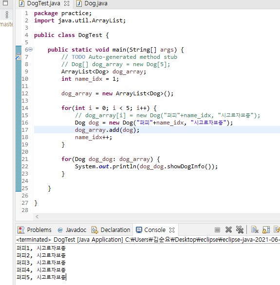

# chapter 7 연습문제


## Q1)

배열은 `같은` 자료형을 순서대로 관리할 때 사용하는 자료구조 입니다.


## Q2)

```java
package array;

public class CharArray{
    public static void main(String[] args){
        char[] alphabets = new char[26];
        char ch = 'a';
        
        for(int i = 0; i < alphabets.length; i++, ch++){
            alphabets[i] = ch;
        }
        
        for(int i = 0; i < alphabets.length; i++){
            System.out.println(alphabets[i] + "," + int(alphabets[i]));
        }
        
    }
}
```


## Q3)

```java
public class EvenArray{
    public static void main(String[] args){
        int[] even_array = new int[5];
        int num = 1;
        for(int i = 0; i < even_array.length; i++){
            if num % 2 == 0{
               //짝수인 경우
               even_array[i] = num;
            }
            num++;
        }
        
        total = 0;
        for(int i = 0; i < even_array.length; i++){
            total += even_array[i];
        }
        System.out.println(total);
    }
}
```


## Q4)

## Q5)


